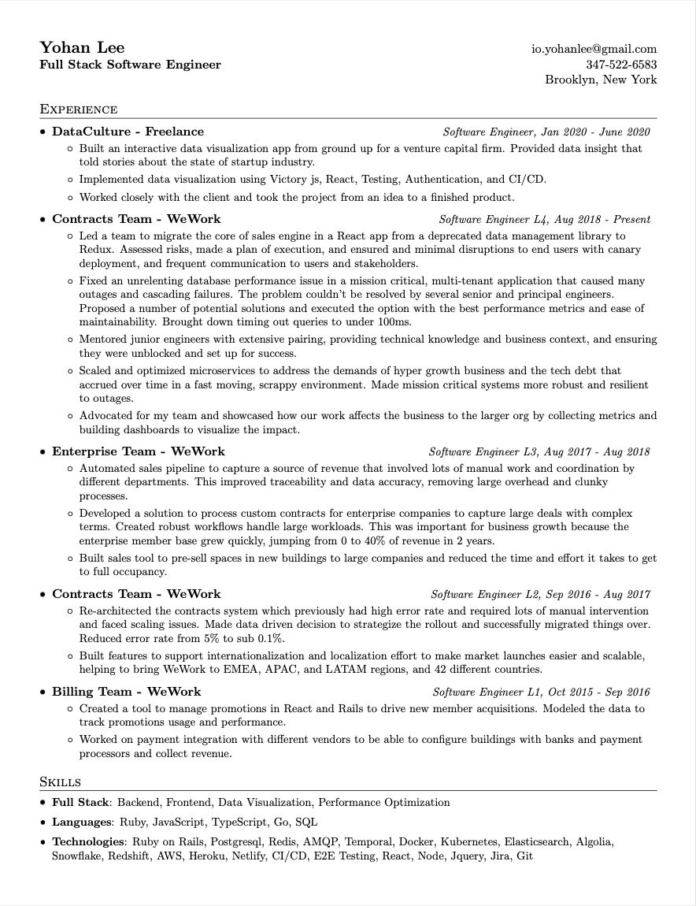
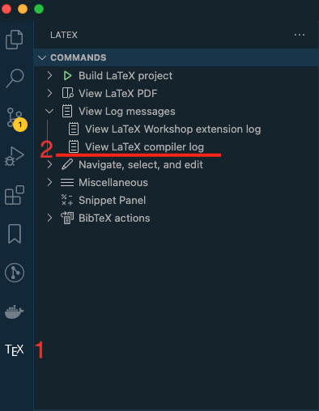
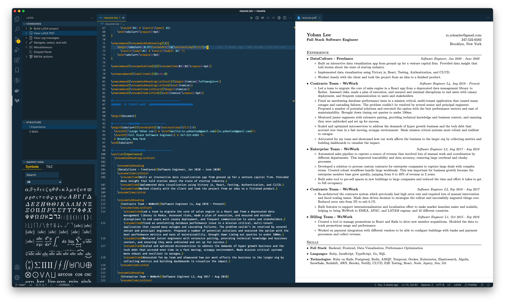
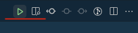

<h1 align="center"> <br />Resume</h1>
<p align="center"><strong>LaTeX cv made easy-ier 😜</strong></p>

Takes your cv in [LaTeX](resume.tex) and generates a [pdf](resume.pdf). It was inspired by [sb2nov/resume](https://github.com/sb2nov/resume) and tweaked to my personal needs and improved with a simpler workflow. The original setup required docker and running build commands in terminal to regenerate the pdf every time you made edits. With this approach, you can edit LaTeX and preview the pdf all in one place and automatically see the updates.
## Table of Contents
- [Table of Contents](#table-of-contents)
- [Preview](#preview)
- [Pre-requisites](#pre-requisites)
  - [MikTeX](#miktex)
    - [Steps](#steps)
  - [LaTeX Workshop](#latex-workshop)
  - [🔴 Troubleshooting](#-troubleshooting)
- [How to Use](#how-to-use)
- [Credits](#credits)


## Preview



## Pre-requisites

- MacOS (I'm sure you can do this in Windows and Linux but I haven't gone through the setup myself.)
- [MiKTeX](https://miktex.org/) - LaTeX binary
- [VSCode](https://code.visualstudio.com/) - Editor
- [LaTeX-Workshop](https://github.com/James-Yu/LaTeX-Workshop) - VSCode extension for LaTeX

### MikTeX

To get LaTeX-Workshop to work, you are going to need a binary for LaTeX. They list different LaTeX distributions on their [documentation](https://github.com/James-Yu/LaTeX-Workshop/wiki/Install#requirements), and if you don't already have set up LaTeX on your machine it's hard to figure out exactly what you need. Having gone through the trials and tribulations of installations, what I recommend is [MiKTeX](https://miktex.org/). It was the simplest to get set up without much additional configs. I found that TexLive and MacTex were confusing to set up and I could not get them to work.

> 🚧  **Please note**: I advise installing MikTeX first before LaTeX-Workshop for reasons explained in [Troubleshooting](#-troubleshooting) section.

#### Steps

- [Download](https://miktex.org/download) Miktex for MacOS

- Install MkTex and updates and allow system permissions - [Installation guide for MacOS](https://miktex.org/howto/install-miktex-mac)

- Ensure that binary is installed properly

  ```bash
  which latexmk
  ```

  Should return

  ```bash
  /Users/{user}/bin/latexmk
  ```

- Update `$PATH` in `.zshrc` or equivalent.

  *.zshrc*

  ```bash
  export PATH="$HOME/bin:$PATH"
  ```

### LaTeX Workshop

- Find `LaTeX Workshop` in VSCode market place and install
- If you have installed `MikTeX` in your system already it should just work! If not, go through the [MikTeX](#miktex) setup steps.

### 🔴 Troubleshooting

- Check compiler log for error messages. Most likely you are experiencing issues with LaTeX binary and not the extension.

    

- `fatal error: spawn latexmk ENOENT` error

  - Make sure you've installed [MikTeX](#miktex) and can run `latexmk` executable.
  - The extension caches `PATH` and does not pick up changes to it after the initial installation ([see github issue](https://github.com/James-Yu/LaTeX-Workshop/issues/2625)). In other words, it doesn't know how to locate the binary. When this happens, just restart your computer. I've found that that's the only thing that works. I tried reopening the project, restarting VSCode, uninstalling and reinstalling the extension to no avail.

## How to Use



- Make sure you've gone through all of [pre-requisites](#pre-requisites)!
- Open up `resume.tex` in VSCode
- Click "Build LaTeX Project" and "View LaTeX PDF file" buttons on the top right

  
- Happy hacking! 🥳

## Credits

The base tex file was taken from [sb2nov/resume](https://github.com/sb2nov/resume/blob/master/sourabh_bajaj_resume.tex).
